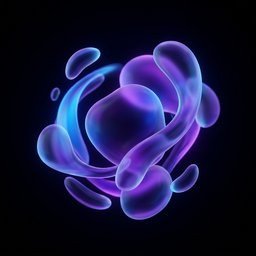

# 🌌 Aura: Immersive Backgrounds for AgentZero

**Aura** is a premium aesthetic plugin that transforms the static AgentZero workspace into a living, fluid environment. 

Inspired by modern glassmorphic design, Aura adds theme-aware motion backgrounds that react to the agent's state, providing a deeply immersive and premium feel to your AI interactions.



## 🌟 Features

- **Fluid Motion**: High-performance, GPU-accelerated CSS animations that create a "breathing" workspace.
- **Theme-Aware**: Automatically inherits your AgentZero theme colors (Accent, Primary, Secondary) for perfect visual harmony.
- **Reactive States**: Background intensity and motion speed increase when the agent is "thinking" or processing tasks.
- **Glassmorphic Depth**: Enhances the existing UI with subtle backdrop blurs and transparent layers.
- **Native Integration**: Built using AgentZero's Alpine.js store pattern for a lightweight and flicker-free experience.

## 🚀 Installation

1. Install via the **AgentZero Plugin Hub**.
2. Or, clone this repository directly into your `usr/plugins/` directory:
   ```bash
   git clone https://github.com/AATheBuilder/a0-aura-plugin.git aura_plugin
   ```
3. Enable "Aura" in **Settings → Plugins**.
4. Refresh the page!

## 🛠️ Requirements
- AgentZero version with Plugin Support.
- A modern browser with hardware acceleration enabled for optimal performance.

## 📄 License
MIT
